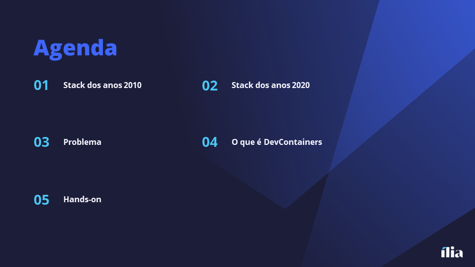
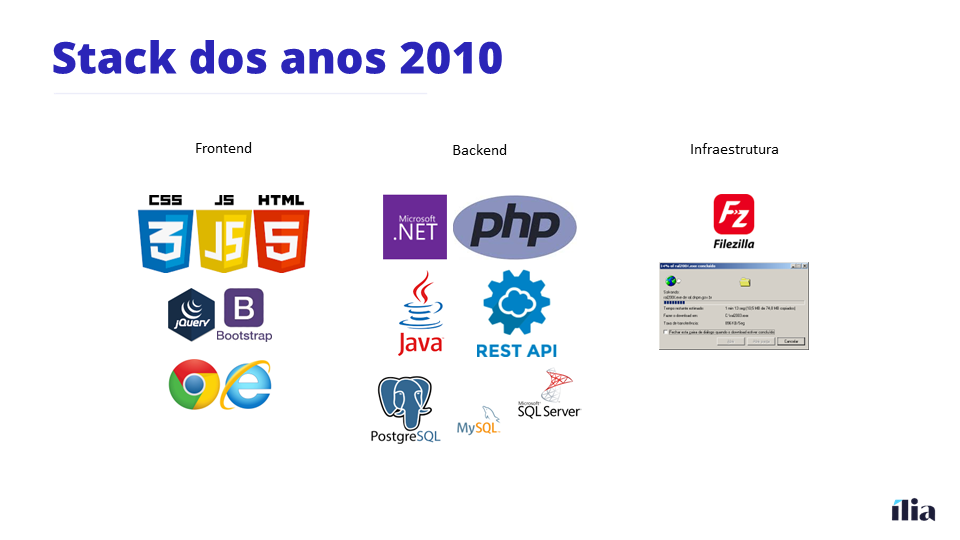
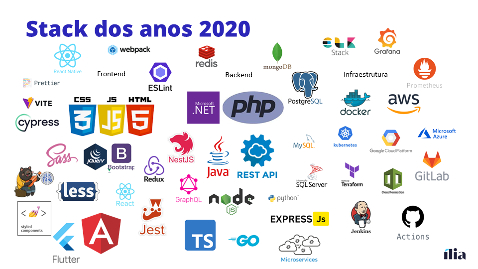
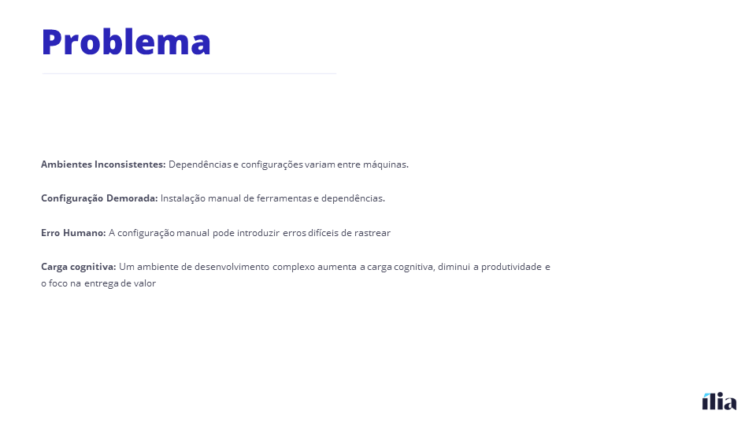
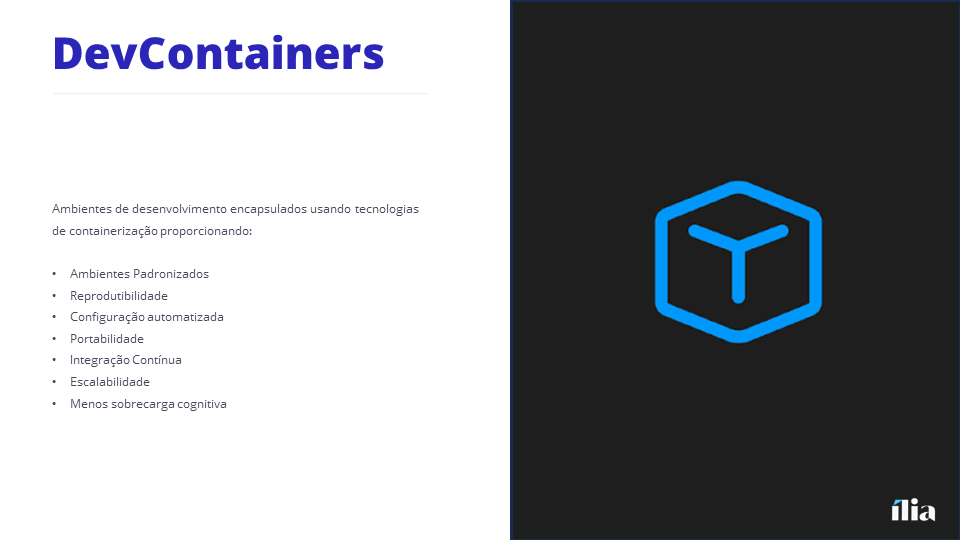
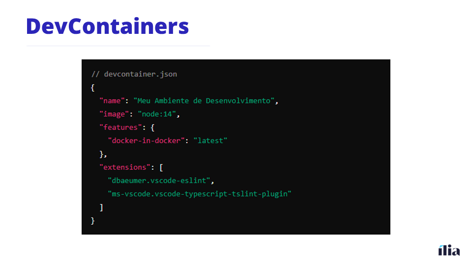

# Making Dev Life Easier With DevContainers

Esse repositório é parte de uma palestra sobre dev containers. 

# Presentation

Olá, sou formado em Engenharia da computação, e trabalho na área já faz algum tempo. Tive a oportunidade de desenvolver vários produtos e hoje atuo na criação de novos produtos. 

Mesmo atuando na área de produtos, ainda gosto muito de me mantar atualizado, e desenvolvendo novos projetos.  

Hoje vamos falar um pouco sobre como a vida do dev vem ficando cada vez mais complicada ao longo dos últimos anos, aumentando a carga cognitiva do desenvolvedor. 

Vamos ver como era a Stack de um full stack lá em 2010 e comparar ela com a Stack mais moderna dos anos 2020. 

Vamos falar sobre o problema que o aumento da complexidade da nossa Stack de desenvolvimento traz para o dia a dia do dev. 

E por fim, vamos conversar sobre devcontainers botando a mão na massa. 

Lá quando eu comecei em 2010, a vida de dev era bem mais simples. 
Quem aqui lembra o que precisávamos saber para fazer um frontend?

<Participação da audiência>

Nosso maior problema era fazer o mesmo código funcionar no chrome e no ie. 

E de backend, o que vocês usavam?

<Participação da audiência>

E de infra, como vocês faziam o deploy das suas aplicações? 

<Participação da audiência>

Vocês acham que nossa vida ficou mais complexa? Com certeza a nossa carga cognitiva aumentou! Hoje precisamos instalar e gerenciar muito mais ferramentas do que precisávamos lá atrás. 

Essas novas ferramentas resolveram vários problemas, mas também trouxeram novos problemas...

Quem aqui já usou aquela famosa frase "Na minha máquina funciona"? Pois é cada vez é mais difícil garantir que cada computador de cada membro do time está configurado da mesma maneira. As vezes no seu computador está funcionando, mas quando você vai subir para produção quebra tudo. 

Quem aqui já desistiu de trocar de computador para não ter que fazer todo o setup da máquina novamente? Geralmente quando precisamos passar por esse processo de setup perdemos entre 1 e 2 semanas. Isso quando você não instala as dependências em uma ordem diferente que cria um cenário de erro muitas vezes difícil de resolver.

E como falado anteriormente, gerenciar o ambiente de desenvolvimento é mais uma tarefa que precisamos saber o que aumenta a nossa carga cognitiva, ou seja, o que precisamos saber para conseguir desenvolver, e diminui a nossa produtividade tirando o foco na entrega de valor. 

Mas então como solucionar esses problemas? 
Lá em 2019, a Microsoft começou a criar a especificação do devcontainer. A ideia era: "Abra seu código na nuvem, em um contêiner local, em uma máquina remota ou em WSL e aproveite o conjunto completo de recursos do VS Code."

Hoje o devcontainer tem sua própria organização no github. A ideia continua similar a original: A especificação do devconteiner define um padrão para qualquer ferramenta de desenvolvimento usar um contêiner como um ambiente de desenvolvimento completo.

- Ambientes Padronizados: Todos os desenvolvedores trabalham no mesmo ambiente, evitando o clássico "funciona na minha máquina".
- Reprodutibilidade: Facilita a configuração e reprodução do ambiente em qualquer máquina.
- Configuração Automatizada: Usa arquivos de configuração (Dockerfile, devcontainer.json) para definir e configurar o ambiente automaticamente. Reduz a carga de trabalho e os erros associados à configuração de ambientes
- Portabilidade: Mova facilmente entre diferentes ambientes de desenvolvimento.
- Integração Contínua: Facilita a configuração de pipelines de CI/CD consistentes.
- Escalabilidade: Aumenta a capacidade de trabalhar em projetos complexos sem sobrecarregar a capacidade cognitiva. Permite que desenvolvedores dediquem mais tempo à solução de problemas e inovação.

Esse é um exemplo básico de uma especificação de um devcontainer. Com poucas linhas de código você já consegue criar um ambiente node.js funcional. 

O papo está bom, mas bora colocar a mão na massa e ver se esse tal de devcontainer realmente funciona.

Material do hands-on:
- [DevContainer with node application](https://github.com/Perdiga/node-devcontainer)
- [DevContainer with node application, postgreSQL and liquebase](https://github.com/Perdiga/node-postgree-devcontainer)
- [DevContainer with localstack](https://github.com/Perdiga/node-localstack-devcontainer)

